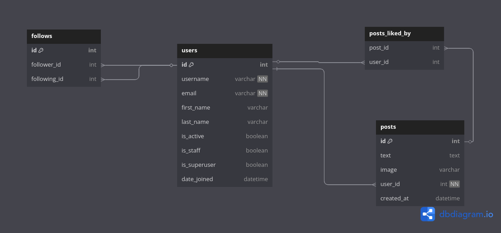
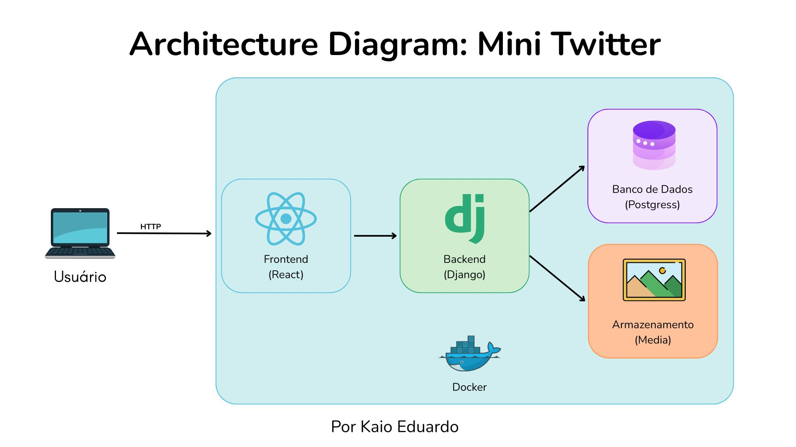

# Mini Twitter

Este é um projeto de uma rede social simplificada, similar ao Twitter, com frontend em React e backend em Django. A aplicação utiliza Docker para facilitar a configuração e o deploy.

## Passo a Passo para Rodar o Projeto

### 1. Pré-requisitos

Certifique-se de ter os seguintes itens instalados no seu sistema:
- [Docker](https://www.docker.com/)
- [Docker Compose](https://docs.docker.com/compose/)
- [Git](https://git-scm.com/)

### 2. Clonar o Repositório

Clone o repositório do projeto para o seu diretório local:

```bash
git clone https://seu-repositorio-url.git
cd mini-twitter
```

### 3. Configurar Variáveis de Ambiente

Crie um arquivo `.env` na raiz do projeto com base no arquivo `.env.example`. Você pode usar o seguinte comando para copiar o exemplo:

```bash
cp .env.example .env
```

Edite o arquivo `.env` e preencha as variáveis de ambiente conforme necessário. Por exemplo:

```properties
DB_NAME=mini_twitter
DB_USER=admin
DB_PASSWORD=admin123
DB_HOST=db
DB_PORT=5432
SECRET_KEY=uma_chave_secreta_segura
DEBUG=True
```

### 4. Subir os Contêineres com Docker Compose

Execute o seguinte comando para construir e iniciar os serviços (banco de dados, backend e frontend):

```bash
docker-compose up --build
```

- O backend estará disponível em: [http://localhost:8000](http://localhost:8000)
- O frontend estará disponível no endereço de rede fornecido pelo Vite. Procure pela linha `Network` no terminal, algo como:

```
frontend_1  |   ➜  Network: http://172.22.0.3:5173/
```

Acesse o endereço exibido no terminal para abrir o frontend.

### 5. Criar um Superusuário (Opcional)

Se desejar acessar o painel administrativo do Django, crie um superusuário:

```bash
docker-compose exec backend python manage.py createsuperuser
```

Depois, acesse o painel administrativo em: [http://localhost:8000/admin](http://localhost:8000/admin)

### 6. Testar a Aplicação

Agora você pode acessar a aplicação:
- Frontend: No endereço de rede fornecido pelo Vite.
- Backend (API): [http://localhost:8000/api](http://localhost:8000/api)

### 7. Parar os Contêineres

Para parar os contêineres, use o comando:

```bash
docker-compose down
```

### 8. Limpar Dados (Opcional)

Se desejar limpar os dados do banco de dados e volumes, use:

```bash
docker-compose down -v
```

### 9. Estrutura do Projeto

- **frontend/**: Código do frontend em React.
- **backend/**: Código do backend em Django.
- **docker-compose.yml**: Configuração do Docker Compose.
- **.env**: Arquivo de variáveis de ambiente.

### 10. Documentação da API

Acesse a documentação interativa da API em:
- Swagger: [http://localhost:8000/api/docs/](http://localhost:8000/api/docs/)
- Redoc: [http://localhost:8000/api/redoc/](http://localhost:8000/api/redoc/)

### 11. Problemas Comuns

- **Portas em Uso**: Certifique-se de que as portas `5173` e `8000` não estão sendo usadas por outros serviços.
- **Erro de Conexão com o Banco de Dados**: Verifique se as variáveis de ambiente no `.env` estão corretas.

### 12. Diagramas

#### Diagrama ERD (Entity-Relationship Diagram)
- Link para o diagrama ERD: [ERD Diagram](https://dbdiagram.io/d/6817b21d1ca52373f566d2cd)
- Imagem do diagrama ERD:


#### Diagrama de Arquitetura
- Imagem do diagrama de arquitetura:


### 13. Desenvolvido por

Este projeto foi desenvolvido por [Kaio Eduardo](https://kaioeduardo.com).

Agora você está pronto para usar o Mini Twitter! 🚀
